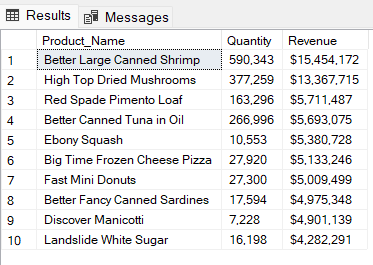
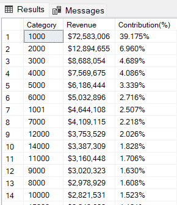
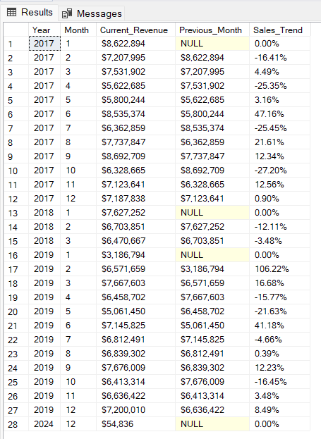
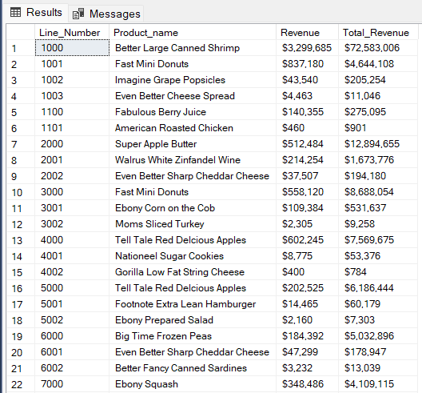
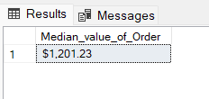
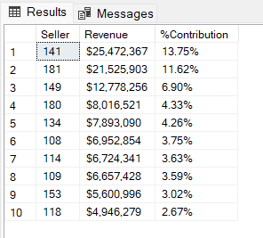
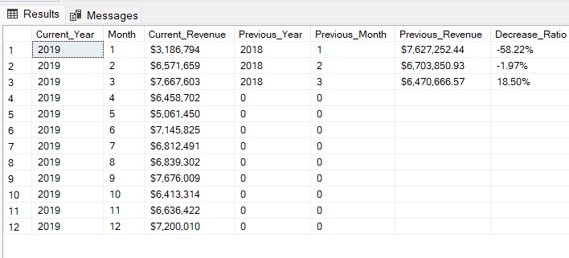
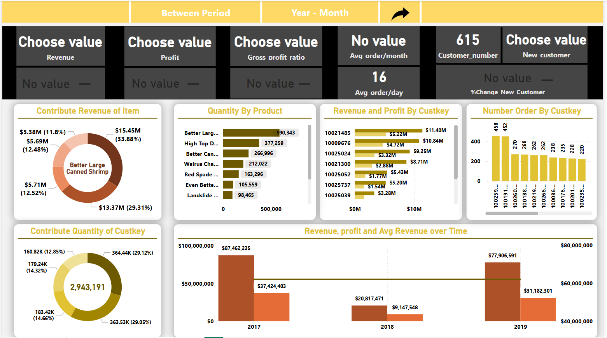
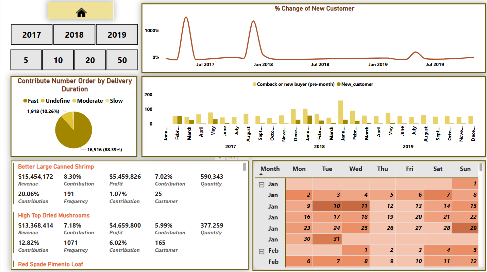

# Amazon_sales (Phân tích một phần về hoạt động kinh doanh của sàn thương mại điện tử Amazon) 💻🏷️

## Introduction (Giới thiệu)

Với mục chính của việc phân tích 📊 dữ liệu hoạt động của sản thương mại điện tử Amazon nhằm việc phân tích về hoạt động kinh doanh của sàn. Bên cạnh đó với mục đích khác nhằm rèn luyện, nâng cao những kỹ năng phân tích của tôi

## Problems (Vấn đề) ⁉️

### Những vấn đề cần 🔎 phân tích:

1. Truy vấn 10 sản phẩm hàng đầu theo tổng giá trị bán hàng. Bao gồm tên sản phẩm, tổng số lượng bán ra và tổng giá trị bán hàng
2. Tính tổng doanh thu tạo ra bởi mỗi danh mục sản phẩm. Bao gồm tỷ lệ phần trăm đóng góp của mỗi danh mục vào tổng doanh thu
3. Truy vấn tổng doanh số bán hàng trong năm qua. Hiển thị xu hương bán hàng, so sánh so với tháng liên trước trong cùng một năm
4. Xác định sản phẩm bán chạy nhất cho từng danh mục. Bao gồm tổng doanh số cho danh mục đó
5. Tính giá trị đơn hàng trung bình cho mỗi khách hàng. Chỉ bao gồm những khách hàng có hơn 20  đơn hàng. Và tìm giá trị trung bình của đơn hàng
6. Tìm 10 ID người bán hàng hàng đầu dựa trên tổng giá trị bán hàng. Và hiển thị phần trăm doanh số của họ trên tổng doanh số của Sales Rep
7. Xác định những sản phẩm có tăng trưởng doanh thu giảm (so sánh giữa năm 2019 và năm 2018). Giá trị trả về gồm tên sản phẩm, doanh thu năm 2018 và 2019 cùng với tỷ lệ thay đổi (tăng/giảm)

## Tools I Used (Những công cụ đã sử dụng) ⚙️🛠️

**- SQL Server:** Dùng để truy vấn

**- Power BI:** Để trực quan hóa dữ liệu dưới dạng biểu đồ, bảng biểu

**- Github:** Dùng để đăng bài phân tích lên nhằm mục đích chia sẻ cho mọi người cùng tham khảo và đánh giá


## The Analysis (Phân tích) 📉📈
1. Truy vấn 10 sản phẩm hàng đầu theo tổng giá trị bán hàng. Bao gồm tên sản phẩm, tổng số lượng bán ra và tổng giá trị bán hàng
```sql
SELECT TOP 10
  Item Product_Name, 
  FORMAT(SUM(Sales_Quantity), 'N0') Quantity,
  FORMAT(SUM((Sales_Quantity * Sales_Price)),'C0') Revenue
FROM Amazon
GROUP BY Item
ORDER BY SUM((Sales_Quantity * Sales_Price)) DESC
```


2. Tính tổng doanh thu tạo ra bởi mỗi danh mục sản phẩm. Bao gồm tỷ lệ phần trăm đóng góp của mỗi danh mục vào tổng doanh thu
```sql
SELECT 
  Category, 
  FORMAT(Revenue, 'C0') Revenue, 
  FORMAT(Revenue/(SELECT SUM(Sales_Quantity * Sales_Price) Total_Revenue FROM Amazon), 'P3') 'Contribution(%)'
FROM 
  (SELECT 
    Line_Number Category, 
    SUM(Sales_Quantity * Sales_Price) Revenue
  FROM Amazon
  GROUP BY Line_Number) AS Table2
ORDER BY (Revenue/(SELECT SUM(Sales_Quantity * Sales_Price) Total_Revenue FROM Amazon)) DESC
```


3. Truy vấn tổng doanh số bán hàng trong năm qua. Hiển thị xu hương bán hàng, so sánh so với tháng liền trước trong cùng một năm
```sql
SELECT
  Year, Month, FORMAT(Revenue, 'C0') Current_Revenue, 
  FORMAT(Previous_Month,'C0') Previous_Month,
  FORMAT(ISNULL((Revenue - Previous_Month)/Previous_Month,0), 'P') Sales_Trend
FROM 
  (SELECT
    Year, Month, Revenue,
    LAG(Revenue) OVER ( PARTITION BY Year ORDER BY Year ASC, Month ASC) Previous_Month
  FROM 
    (SELECT 
      YEAR(DateKey) Year, MONTH(DateKey) Month,
      SUM(Sales_Price * Sales_Quantity) Revenue
    FROM Amazon
    GROUP BY YEAR(DateKey), MONTH(DateKey)) AS Table1) AS Table2
```


4. Xác định sản phẩm bán chạy nhất cho từng danh mục. Bao gồm tổng doanh số cho danh mục đó
```sql
WITH Table3 AS
(SELECT 
  Line_Number, FORMAT(SUM(Revenue),'C0') Total_Revenue
FROM
  (SELECT 
    Line_Number ,Item Product_name, SUM(Sales_Price * Sales_Quantity) Revenue  
  FROM Amazon
  GROUP BY Line_Number, Item) AS Table2
GROUP BY Line_Number),
Table4 AS
(SELECT
  Line_Number, Product_name, FORMAT(Revenue, 'C0') Revenue
FROM 
  (SELECT 
    Line_Number, Item Product_name, 
    SUM(Sales_Price * Sales_Quantity) Revenue,
    RANK() OVER (PARTITION BY Line_Number ORDER BY SUM(Sales_Price * Sales_Quantity) DESC) Rank
  FROM Amazon 
  GROUP BY Item, Line_Number, Sales_Price, Sales_Quantity) AS Table1
WHERE Rank = 1)
-------
SELECT
  T4.Line_Number, Product_name, Revenue, Total_Revenue
FROM Table3 as T3 
JOIN Table4 as T4 ON T3.Line_Number = T4.Line_Number
```


5. Tính giá trị đơn hàng trung bình cho mỗi khách hàng. Chỉ bao gồm những khách hàng có hơn 20  đơn hàng. Và tìm giá trị trung bình của đơn hàng
```sql
WITH Table1 AS
(  
  SELECT 
    Custkey Customer
  FROM Amazon
  GROUP BY Custkey
  HAVING COUNT(Invoice_Number) > 20
),
Table2 AS  
(		
  SELECT  -- Create subtale to made index number column
    ROW_NUMBER() OVER (ORDER BY Avg_Order_value DESC) Row_num,
    Customer, Avg_Order_value
  FROM 
    (SELECT 
      Custkey Customer, 
      CAST(AVG(Sales_Price * Sales_Quantity) AS Decimal(10,2)) Avg_Order_value
    FROM Amazon
    WHERE Custkey in (SELECT * FROM table1)
    GROUP BY Custkey) AS Table3
),
Median_table AS
(
  SELECT 
    COUNT(*) Number_order,
    CASE
      WHEN COUNT(*) % 2 = 0 THEN COUNT(*)/2
      ELSE (COUNT(*)+1) / 2
    END Median_value1,
    CASE
      WHEN COUNT(*) % 2 = 0 THEN (COUNT(*)+2)/2
      ELSE (COUNT(*)+1) / 2
    END Median_value2
  FROM Table2
)
--- Find the median value
SELECT
  FORMAT(AVG(Avg_order_value), 'C2') Median_value_of_Order
FROM 
  (SELECT 
    Row_num, Customer,
    Avg_order_value
  FROM Table2 as t2 
  JOIN Median_table as mt ON mt.Median_value1 = t2.Row_num OR mt.Median_value2 = t2.Row_num) as Result
```


6. Tìm 10 ID người bán hàng hàng đầu dựa trên tổng giá trị bán hàng. Và hiển thị phần trăm doanh số của họ trên tổng doanh số của Sales Rep
```sql
WITH Sale_Total AS
(SELECT 
  SUM(Sales_Price * Sales_Quantity) Total_Revenue
FROM Amazon),
Sales AS
(SELECT
    Sales_Rep Seller, 
    FORMAT(SUM(Sales_Price * Sales_Quantity),'C0') Revenue,
    SUM(Sales_Price * Sales_Quantity) Sales_Value
FROM Amazon
GROUP BY Sales_Rep)
-----
SELECT TOP 10
  Seller, Revenue, 
  FORMAT((Sales_Value/(SELECT*FROM Sale_Total)),'P2') '%Contribution'
FROM Sales
ORDER BY Sales_Value DESC
```


7. Xác định những sản phẩm có tăng trưởng doanh thu giảm (so sánh giữa năm 2019 và năm 2018). Giá trị trả về gồm tên sản phẩm, doanh thu năm 2018 và 2019 cùng với tỷ lệ thay đổi (tăng/giảm)
```sql
WITH Table1 AS
(SELECT 
  YEAR(Datekey) Year, Item Product,
  SUM(Sales_Price * Sales_Quantity) Total_Revenue
FROM Amazon
WHERE YEAR(Datekey) BETWEEN 2018 and 2019
GROUP BY Item, YEAR(Datekey)
)
SELECT 
  Product, [Year-2019] , 
  FORMAT( [Revenue-2019], 'C0') '2019-Revenue', FORMAT([Revenue-2018], 'C0') '2018-Revenue',
  [%Change]
FROM 
  (SELECT 
    cur.Product Product,
    pre.Year 'Year-2018', pre.Total_Revenue 'Revenue-2018',
    cur.Year 'Year-2019', cur.Total_Revenue 'Revenue-2019',
    FORMAT( (cur.Total_Revenue - pre.Total_Revenue)/ CAST(pre.Total_Revenue as decimal(10,2)), 'P2') '%Change',
    ( cur.Total_Revenue - pre.Total_Revenue )/ CAST(pre.Total_Revenue as decimal(10,2)) To_order
  FROM Table1 as cur 
  JOIN Table1 as pre ON pre.Year = cur.Year - 1 AND pre.Product = cur.Product) AS Final_table
WHERE to_order < 0
ORDER BY To_order ASC, Product ASC
```


## Conclusion (Kết luận) 📝

### **Tổng quan**

Trong năm 2019, tổng doanh thu của sàn thương mai điện tử Amazon ghi nhận đạt gần hơn 77.9 triệu USD, tăng khoảng 274.24% so với năm liền trước (năm 2019 ghi nhận đạt hơn 20.8 triệu USD. Về lợi nhuận gộp (khi doanh thu thuần trừ đi giá vốn cũng như nhưng chiết khấu) đạt sấp sỉ gần 31.2 triệu USD tăng 240.88% so với năm 2018 (năm 2018 lợi nhuận gộp đạt hơn 9.1 triệu USD). Doanh thu và lợi nhuận trung bình trong khoảng thời gian thu có ghi nhận dữ liệu từ năm 2017 – 2019 ghi nhận đạt lần lượt là khoảng 62.1 triệu USD và hơn 25.9 triệu USD.

Nhưng lưu ý rằng, trong năm 2018 chỉ có có ghi nhận vỏn vẹn trong quý 1 trong khi đó nhưng tháng còn lại trong năm 2018 không ghi nhận dữ liệu hoat động kinh doanh nào.

### **Lượng khách hàng**

Về số lượng khách hàng thì trong 3 năm qua tổng lượng khách hàng mua hàng trên sàn TMĐT đạt 615 người. Cụ thể hơn, trong năm 2017 ghi nhận có 457 khách hàng, trong năm 2018 ghi nhận 312 và đạt 350 trong năm 2019.

### **Đơn hàng và sản lượng sản phẩm**

Về số lượng đơn hàng trung bình hàng tháng có khoảng 637 đơn hàng trong năm 2019, còn về hàng ngày ước lượng có 20 đơn hàng/ngày. Về tổng sản lượng sản phẩm bán được trong năm 2019 đạt 1,260,443 đơn vị sản phẩm, năm 2018 chỉ bán được 326,625 sản phẩm còn năm 2017 số lượng bán được đạt 1,356,123 đơn vị sản phẩm.

### **Sản phẩm**

Tính theo lũy kế trong 3 năm liên tiếp, sản phẩm bán chạy nhất là Better Large Canned Shrimp với tổng doanh thu đạt khoảng 15.45 triệu USD chiếm đến 33.88% doanh thu tổng của tất của các sản phẩm. Cu thể, trong năm 2017, sản phẩm đừng đầu về doanh thu là Better Large Canned Shrimp (đạt 6.89 triệu USD và chiếm 32.11% trong tổng doanh thu), đối với năm 2018 vẫn là Better Large Canned Shrimp (đạt 2.36 triệu USD và chiếm 38.04%) và cuối cùng năm 2019, sản phẩm đứng đầu là Better Large Canned Shrimp (với doanh thu ghi nhận đạt 6.41 triệu USD và chiếm 33.56%)

## [Hình ảnh từ file Power BI](https://github.com/HuyNguyen255/Amazon_sales/blob/116de97e0fdaa47a9a1084411de1ad10d9bd99db/Amazon%20Dashboard.pbix)





